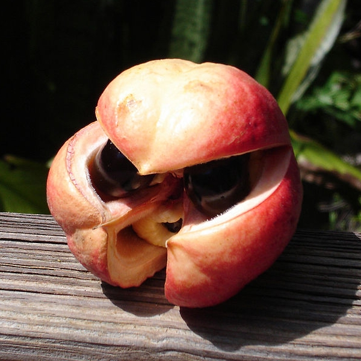
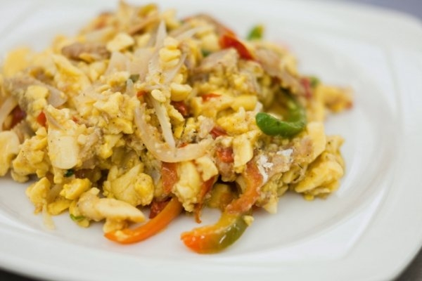
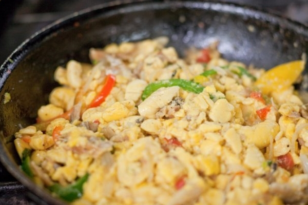

#########################
Ackee and Saltfish Recipe
#########################

The original version of this recipe was published on the `Jamaica Inn Hotel's blog <https://jamaicainn.com/blog/recipe-ackee-saltfish-jamaicas-national-dish/>`_. All images from that original post.

***********************
Jamaica's National Dish
***********************

When visiting Jamaica, one of the must-try dishes is our national dish, Ackee and Saltfish. It is the most popular among our guests and is available as part of the taste of Jamaica dish during breakfast on Tuesdays and Fridays.

**************
What is Ackee?
**************
Ackee is a pear-shaped fruit that is found in warm climates. As the ackee fruit ripens, it turns from green to bright red to yellow-orange, and splits open to reveal three large, shiny black seeds, each partly surrounded by soft, white to yellow flesh.

This national fruit of `Jamaica <https://jamaicainn.com/jamaica.php>`_ was imported here from East Africa before 1725. Today, ackee fruit is canned and one of Jamaica’s major exports.

******************
Ackee and Saltfish
******************

To prepare the dish, salt cod is sautéed with boiled ackee, onions, Scotch Bonnet peppers, tomatoes and spices. It is usually served as breakfast or dinner alongside breadfruit, hard dough bread, dumplings, fried plantain, or boiled green bananas. Ackee and Saltfish can also be eaten with rice and peas or plain white rice.

Ingredients
===========

Serves 2-4

* ½-pound salt fish
* fresh ackee soaked, or tinned ackee
* 1 medium onion, chopped
* 1 small sweet pepper (yellow/red or green), julienned
* 1 medium tomato, chopped
* 2 cloves of garlic, minced
* 1 teaspoon scotch bonnet pepper, chopped finely (omit if you don’t want the dish spicy)
* 2 stalks scallion, chopped
* 1-2 tablespoons extra virgin olive oil
* salt and pepper to taste

Directions
==========

#. Put saltfish to soak in cold water for about 1 hour.
#. Pour off water; add fresh water and boil until tender.
#. De-bone and flake the saltfish.
#. Heat oil and sauté onion, garlic, scallions, tomatoes, scotch bonnet pepper and sweet pepper until tender, about five to six minutes.
#. Add flaked saltfish, fresh or canned ackee and black pepper.
#. Toss lightly; cover and allow to stand over low heat for about 2 minutes.

Enjoy this most famous Jamaican dish!
