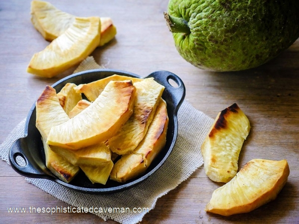

#################################
Roasted & Fried Breadfruit Recipe
#################################

The original version of this recipe was published on `The Sophisticated Caveman <https://www.thesophisticatedcaveman.com/roasted-fried-breadfruit/>`_.

************
Introduction
************

Perhaps you might have passed by these large, scaley green globes in a farmer’s market, wondering what on earth people do with them. I used to think the same thing, until I was introduced to the wonders of breadfruit by my girlfriend and a subsequent trip to Jamaica. Now, I just can’t get enough of it.

Breadfruit is a member of the Jackfruit family, and is native to the South Pacific. It was brought to the Caribbean in the 18th century as cheap food source for slaves, where it remains a staple in many island cuisines to this day.

I would describe the texture and flavor similar to a potato. Roasting breadfruit is really a simple process.  Afterwards, you can also freeze some for later use. A quick fry in some coconut oil after it is roasted produces a crispy and starchy satisfying side that pairs well with pretty much anything.

******
Method
******

Serves 6.

Ingredients
===========

* 1 breadfruit
* 2 tablespoons + 1 teaspoon coconut oil
* sea salt

Selecting Your Fruit
====================

I pick up my breadfruit at Your DeKalb Farmer’s Market, and international farmer’s market here in Atlanta. Generally speaking, you’ll want to roast it as soon as possible. It will only last a day or two before it starts to go bad.

.. image:: images/image-02.jpg

Directions
==========

#. Preheat the oven to 375F.
#. Rinse the breadfruit and dry it well.
#. Using a paring knife, carve out the stem.

    .. image:: images/image-03.jpg

#. Cut a small "x" in the opposite side.

    .. image:: images/image-04.jpg

#. Lightly coat the breadfruit in some coconut oil. Roast in a preheated 375°F oven,, directly on the rack, for 1 – 1 1/2 hours. As it roasts, your kitchen will be filled with the amazing aroma of fresh-baked bread (hence the name). A good sign that the breadfruit is ready is when there is steam is coming out of both ends.

    .. image:: images/image-05.jpg

#. Remove the breadfruit from the oven and allow it to cool. Peel off the outer skin.

    .. image:: images/image-06.jpg

#. Cut it in half, and scoop out the inner core.

    .. image:: images/image-07.jpg

#. Slice into 1/2 inch thick wedges.

    .. image:: images/image-08.jpg

#. (Optional) Heat 2 tablespoons of coconut oil in a large skillet over medium high heat. Working in batches, fry the wedges until golden brown, about 4-5 minutes per side. Remove them from the skillet and drain on a paper towel lined plate.

    .. image:: images/image-09.jpg
    
#. Season the wedges with sea salt before serving.

Recipe Notes
============

Freeze the breadfruit after slicing it if desired. To prepare afterwards, simply defrost, pat dry, and fry as directed.

Enjoy this Jamaican dish!
